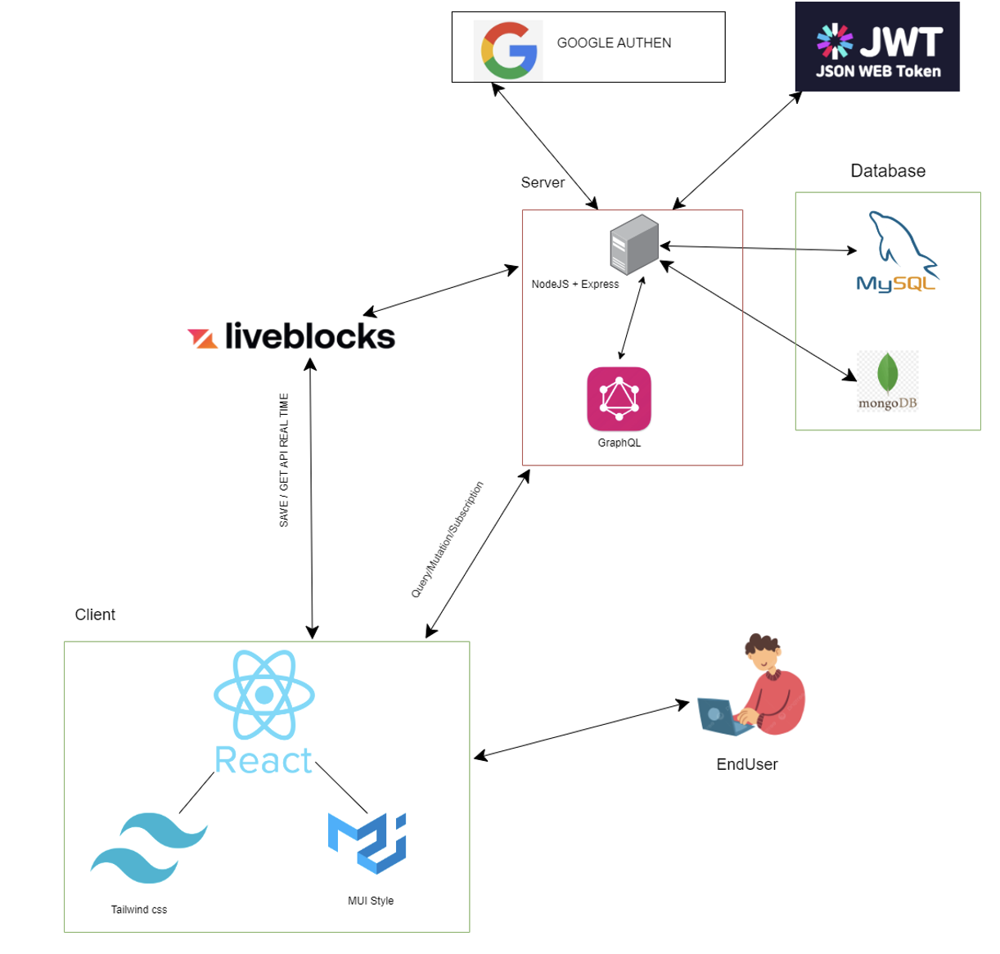
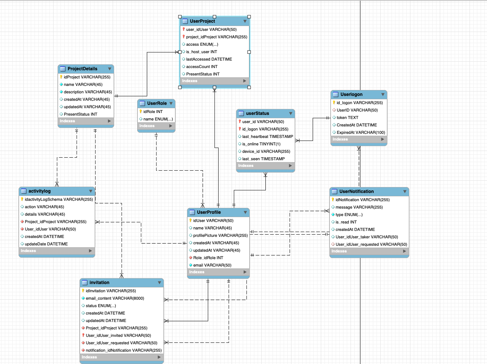

# Realistic Build the Time System

This project is inspired by Figma, allowing users to design interfaces at a basic level. It supports real-time collaboration features such as resizing, changing colors, inviting users to join projects, and moving blocks.

## Features

- **Real-time Collaboration**: Invite users to join projects and collaborate in real time.
- **Project Management**: Create, update, and delete projects with role-based access control.
- **Customizable Design**: Resize and change colors of design elements dynamically.
- **Export Options**: Export designs to PDF format.
- **User Roles**: Manage user roles and permissions within projects.

## Technologies Used

- **Frontend**: React, TypeScript, TailwindCSS, Apollo Client
- **Backend**: Node.js, Express, MySQL
- **Database**: MySQL
- **State Management**: Redux
- **Real-time Communication**: WebSocket
- **PDF Export**: jsPDF

## Project Structure

1. [Architecture](#architecture)
2. [Database Schema](#database-schema)
3. [Installation](#installation)
4. [Usage](#usage)
5. [API Endpoints](#api-endpoints)
6. [Contributing](#contributing)
7. [License](#license)
8. [Contact](#contact)

## Architecture



## Database Schema



## Installation

### Prerequisites

- Node.js (v16 or later)
- MySQL
- Redis (optional, for caching)

### Steps

1. **Clone the repository**:
   ```bash
   git clone https://github.com/your-repo.git
   cd your-repo
   ```
2. **Install dependencies**:
   ```bash
   cd Client
   npm install
   cd ../Server
   npm install
   ```
3. **Configure environment variables**:
   - Create `.env` files in both `Client` and `Server` directories.
   - Add necessary configurations such as database credentials, API keys, etc.
4. **Start the development servers**:
   - For the client:
     ```bash
     cd Client
     npm run dev
     ```
   - For the server:
     ```bash
     cd Server
     npm start
     ```

## Usage

### Creating a Project
1. Navigate to the "Projects" page.
2. Click on "Add Project" and fill in the project details.
3. Invite collaborators by entering their email addresses.

### Managing Roles
- Use the "Manage Members" feature to assign roles such as Host or Collaborator.

### Exporting Designs
- Use the "Export to PDF" option to download your design as a PDF file.

## API Endpoints

### GraphQL Queries and Mutations

#### Queries:
- `getUserProjects`: Fetch user projects.
- `getMememberInProject`: Get members in a project.
- `getNotificationsByUserId`: Fetch notifications for a user.

#### Mutations:
- `addProject`: Create a new project.
- `InvitedUser`: Invite a user to a project.
- `updateInivitation`: Update invitation status.

## Contributing

1. Fork the repository.
2. Create a new branch:
   ```bash
   git checkout -b feature-branch
   ```
3. Commit your changes:
   ```bash
   git commit -m "Add new feature"
   ```
4. Push to the branch:
   ```bash
   git push origin feature-branch
   ```
5. Open a pull request.

## License

This project is licensed under the MIT License. See the LICENSE file for details.

## Contact

For any questions or feedback, please contact [minhtam78945@gmail.com].
